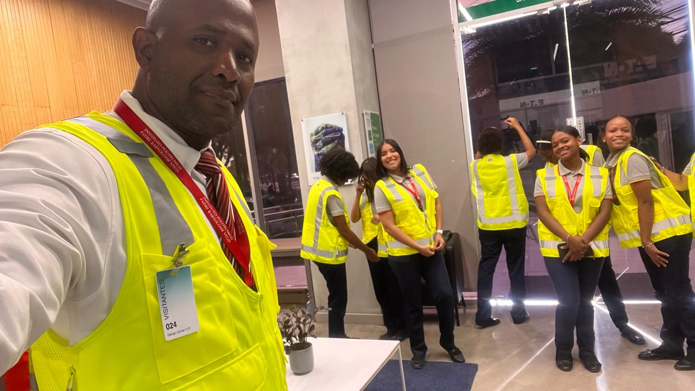
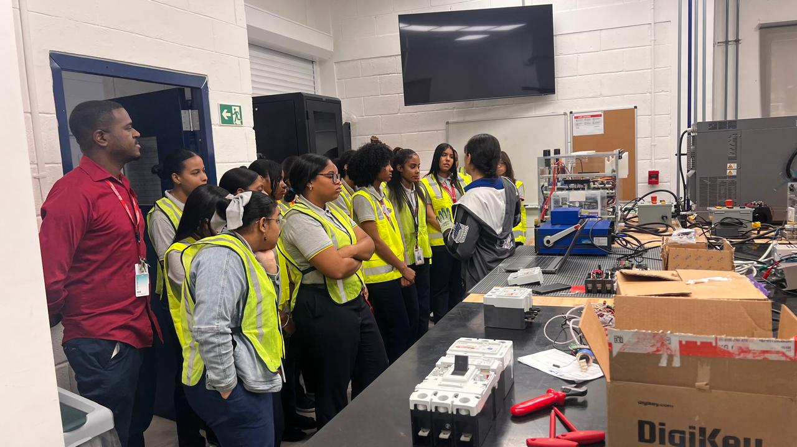

# Galería Fotográfica

En esta sección se presentan las imágenes más representativas de las visitas técnicas y pasantías realizadas por nuestros estudiantes.  
Cada fotografía constituye un testimonio visual de los aprendizajes alcanzados, las experiencias compartidas y los momentos significativos que fortalecen su formación académica y profesional.

La galería no solo busca documentar actividades, sino también poner en valor el esfuerzo, la dedicación y la vinculación con el sector productivo, mostrando cómo cada encuentro contribuye al desarrollo de competencias técnicas, al crecimiento personal y al compromiso social de nuestros jóvenes.

De esta manera, las imágenes se convierten en un archivo institucional vivo, que refleja la identidad del Instituto y la trascendencia de las experiencias formativas más allá del aula, proyectando la misión educativa hacia la comunidad y el futuro profesional de nuestros estudiantes.

## Visitas Técnicas

  <figure>
    
    <figcaption>Estudiantes en la charla</figcaption>
  </figure>
  <figure>
    
    <figcaption>Grupo junto a ingenieras de Eaton</figcaption>
  </figure>
  <figure>
    
    <figcaption>Momento de la presentación</figcaption>
  </figure>

## Pasantías

  <figure>
    
    <figcaption>Foto de pasantía</figcaption>
  </figure>

<!-- Lightbox container -->

  &times;
  
  

