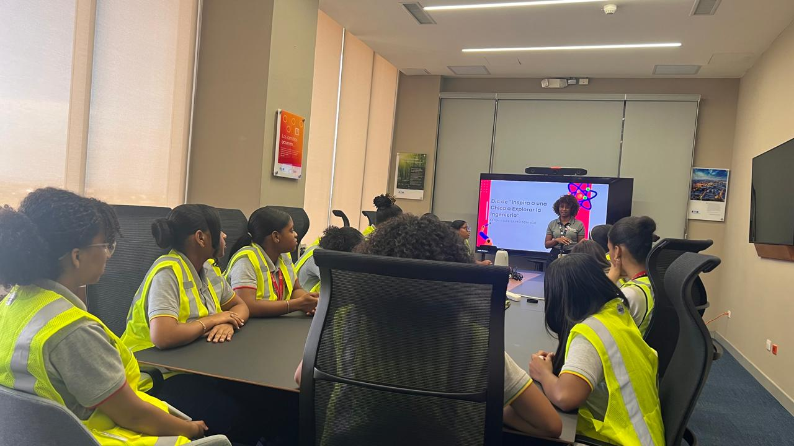
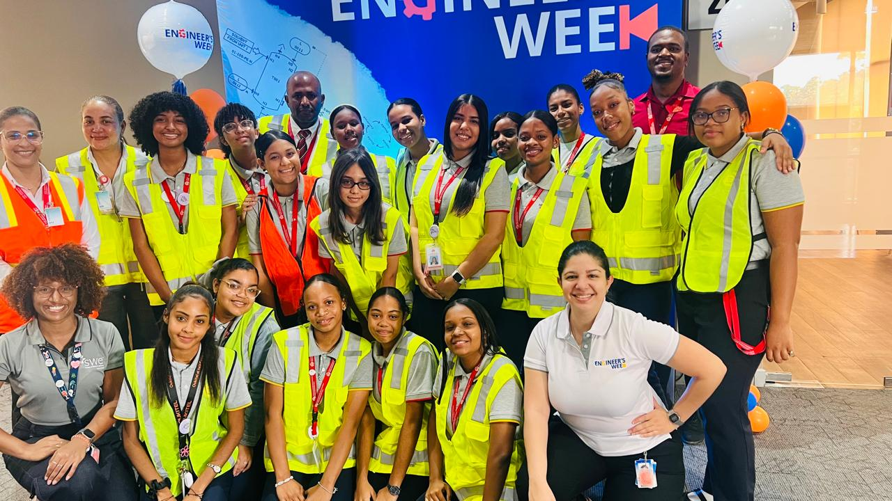

<h1><i class="fa-solid fa-camera"></i> Galería Fotográfica</h1>

  <h2>Índice de Actividades</h2>
  <ul>
    <li><a href="#visita-técnica--eaton-design-center-26-de-febrero-de-2026">Visita Técnica – Eaton Design Center (26 de febrero de 2026)</a></li>
    <li><a href="#pasantía--empresa-xyz-febrero-2026">Pasantía – Empresa XYZ (Febrero 2026)</a></li>
  </ul>

---

En esta sección se presentan las imágenes más representativas de las visitas técnicas y pasantías realizadas por nuestros estudiantes.  
Cada fotografía constituye un testimonio visual de los aprendizajes alcanzados, las experiencias compartidas y los momentos significativos que fortalecen su formación académica y profesional.

La galería no solo busca documentar actividades, sino también poner en valor el esfuerzo, la dedicación y la vinculación con el sector productivo, mostrando cómo cada encuentro contribuye al desarrollo de competencias técnicas, al crecimiento personal y al compromiso social de nuestros jóvenes.

De esta manera, las imágenes se convierten en un archivo institucional vivo, que refleja la identidad del Instituto y la trascendencia de las experiencias formativas más allá del aula, proyectando la misión educativa hacia la comunidad y el futuro profesional de nuestros estudiantes.

---

## Visitas Técnicas

### Visita Técnica – Eaton Design Center (26 de febrero de 2026)

  <figure data-event="Visita Técnica – Eaton Design Center">
    
    <figcaption>Llegada y registro del grupo</figcaption>
  </figure>
  <figure data-event="Visita Técnica – Eaton Design Center">
    
    <figcaption>Coord. OVS junto a parte del grupo luego de registro</figcaption>
  </figure>
  <figure data-event="Visita Técnica – Eaton Design Center">
  
  <figcaption>Uniformadas y listas para la charla y recorrido</figcaption>
</figure>
  <figure data-event="Visita Técnica – Eaton Design Center">
    
    <figcaption>Estudiantes en la charla técnica</figcaption>
  </figure>
  <figure data-event="Visita Técnica – Eaton Design Center">
    
    <figcaption>Recorrido por las instalaciones</figcaption>
  </figure>
    <figure data-event="Visita Técnica – Eaton Design Center">
    
    <figcaption>Grupo junto a ingenieras de Eaton</figcaption>
  </figure>

---

## Pasantías

### Pasantía – Empresa XYZ (Febrero 2026)

  <figure data-event="Pasantía – Empresa XYZ">
    
    <figcaption>Foto de pasantía</figcaption>
  </figure>

---

<!-- Lightbox container -->

  &times;
  
  

  

  <!-- Flechas de navegación -->

<a class="lightbox-prev">&#10094;</a>
<a class="lightbox-next">&#10095;</a>

